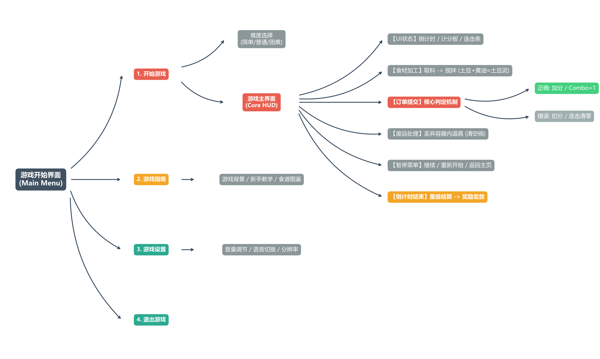

# KrustyKrabGame

# 🍳 模拟烹饪经营游戏 - 核心业务流程设计

这是一个使用 Python (Matplotlib) 自动生成的游戏核心流程图项目。该流程图系统地梳理了一款类似《煮糊了 (Overcooked)》模拟经营游戏的核心生命周期与玩法逻辑。

---

## 🖼️ 游戏流程图预览

这里展示了项目中自动生成的最新流程图：



---

## 🎮 游戏核心流程说明

本项目梳理的业务流程主要包含以下四个核心模块：

1. **开始界面 (Main Menu)**：提供开始游戏、游戏指南、游戏设置和退出游戏四大入口。
2. **核心核心玩法 (Core Loop)**：
  - **食材加工**：点击取料，通过搅拌/烹饪组合道具（例如：土豆 + 黄油 = 土豆泥）。
  - **订单提交**：系统自动验证判定。正确则加分并触发连击（Combo）；错误则扣分并清零连击。
3. **暂停菜单**：支持在游戏途中继续游戏、重新开始或返回主界面。
4. **结算系统**：倒计时结束后触发，根据得分进行星级评定（1-3星）并向玩家发放金币奖励。

---

## 💻 如何运行并生成流程图!

如果你需要重新生成或修改流程图，请确保你的电脑上安装了 Anaconda，并在终端运行以下命令：

```bash

# 运行 Python 脚本生成图片

python [print.py](http://print.py)
```

